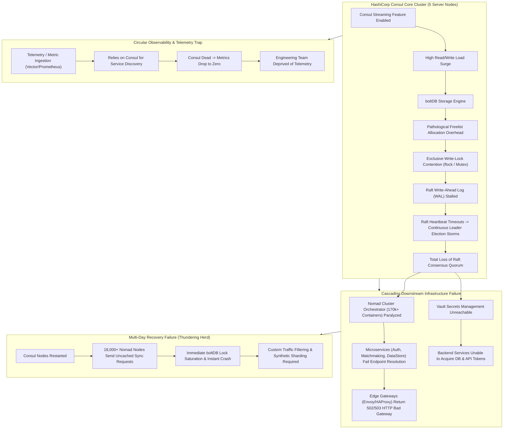
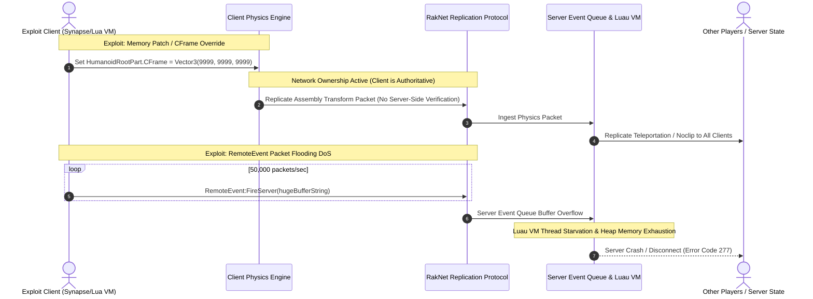

# INFRASTRUCTURE OUTAGES, CASCADING FAILURES & ENGINE BOTTLENECKS

> **Classification:** Platform Infrastructure Architecture & Post-Mortem Systems Engineering  
> **Key Subjects:** The 73-Hour Halloween 2021 Global Outage, HashiCorp Consul Deadlock, boltDB Lock Contention, Thundering Herd Cache Stampedes, and Luau Engine Replication Exploits  
> **Year:** 2026  

---

## 1. The 73-Hour Halloween Global Outage (Oct 28–31, 2021): Technical Post-Mortem

```
+---------------------------------------------------------------------------------------------------+
|                                73-HOUR GLOBAL PLATFORM COLLAPSE                                    |
|   Start: Thursday, Oct 28, 2021 @ 15:45 PDT   |   Full Recovery: Sunday, Oct 31, 2021 @ 16:45 PDT  |
|   Total Duration: 73 Hours, 00 Minutes        |   Affected Systems: 100% of Production Services     |
+---------------------------------------------------------------------------------------------------+
```

### A. The Chipotle Burrito Myth vs. Real Root Cause
Mainstream media blamed the collapse on a localized Chipotle promo ($1M free burritos). However, internal metrics showed the promo added only 25,000–35,000 CCU (<0.7% of platform concurrency). The true root cause was a catastrophic **lock contention deadlock in the HashiCorp Consul service mesh layer**.



### B. The boltDB Lock Contention & Raft Election Storm
1. **Consul Streaming Activation:** Shifting service discovery to gRPC streams increased concurrency on high-core AMD EPYC servers (64–128 cores).
2. **boltDB Freelist Scan Contention:** Under high concurrency, boltDB’s freelist maintenance performed $O(N)$ linear scans inside an exclusive write lock (`sync.RWMutex`), inflating lock hold times from 120µs to **over 3.8 seconds**.
3. **Raft Quorum Collapse:** The leader missed heartbeat intervals (200–500ms), triggering infinite leader election storms.
4. **Circular Observability Trap:** Telemetry and metric pipelines (Vector, Prometheus) relied on the dead Consul cluster for service discovery, dropping metrics to zero and blinding engineers.
5. **The Cold-Boot Thundering Herd:** When nodes were rebooted, 18,000+ bare-metal hosts and 170,000+ Nomad containers simultaneously flooded the 5-node cluster, crashing it repeatedly until iptables throttles were applied.

---

## 2. Core Database Bottlenecks & Cache Stampedes

```
[Cache Key Expiry: Top Game Universe State (TTL = 0)]
                        |
      +-----------------+-----------------+
      |                 |                 |
(Server 1 Miss)   (Server 2 Miss)  ... (Server 10,000 Miss)
      |                 |                 |
      +-----------------+-----------------+
                        |
            [10,000 Concurrent Queries]
                        |
                        v
    [Backend Database Saturated -> Latency > 10,000ms]
                        |
                        v
    [HTTP 504 Gateway Timeout -> Platform Degraded]
```

* **Legacy MSSQL Contention:** High-velocity tables (`UserEconomy`, `InventoryAssets`) suffer lock escalation from row-level to exclusive table locks (`X` locks), causing thread stalls during peak events.
* **Cache Stampedes (Thundering Herd):** Hard TTL expirations on Redis/Memcached keys without application-level request coalescing (`singleflight` pattern) cause thousands of game servers to simultaneously slam the backend database upon cache misses.

---

## 3. Network Replication & Luau Engine Exploits



1. **Client-Authoritative Physics (Network Ownership):** The server grants physics authority of character assemblies to the client without server-side validation. Manipulating `HumanoidRootPart.CFrame` allows instant teleportation, noclip, and high-velocity fling attacks.
2. **RemoteEvent Flooding (DoS):** Because the engine lacks native server-side rate limits on `RemoteEvent:FireServer()`, sending 50,000 RPC packets/second exhausts server heap memory and drops server FPS from 60 to 0.2, crashing instances (Error 277).

---

## 4. Developer Platform Degradations

* **Sunday Peak CCU Failures:** DataStore v2 write request limits ($60 + \text{numPlayers} \times 10\text{ req/min}$) exhaust under high join/leave velocity, triggering `HTTP 429 Too Many Requests` and inventory rollbacks.
* **CDN "Grey Box Void":** When high-volume UGC drops overwhelm S3 origin shields and CDN edge caches, assets fail with 502/504 errors, causing avatars to render as grey bounding boxes and fall through missing floor geometry.
